# 📘 Git Installation & GitHub Usage Guide

This guide is intended for beginners who want to start using Git for version control and GitHub as a platform for collaboration.

---

## 📥 Installing Git

### 🍏 macOS

1. Open the Terminal and type:

   ```bash
   git --version
   ```

   If Git is not installed, you'll be prompted to install **Command Line Tools** — click **Install**.
2. Alternatively, use Homebrew:

   ```bash
   brew install git
   ```

### 🐧 Linux (Debian/Ubuntu)

```bash
sudo apt update
sudo apt install git
```

### 🖥 Windows

1. Download Git from the official website:
   👉 [https://git-scm.com/download/win](https://git-scm.com/download/win)
2. Run the installer and click **Next** until it's finished (default options are fine).
   1. 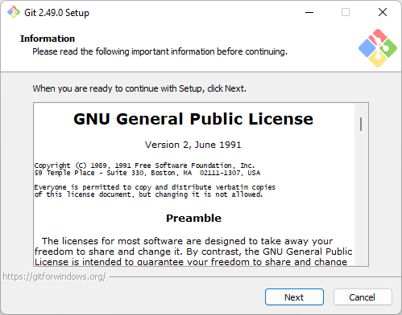
   2. 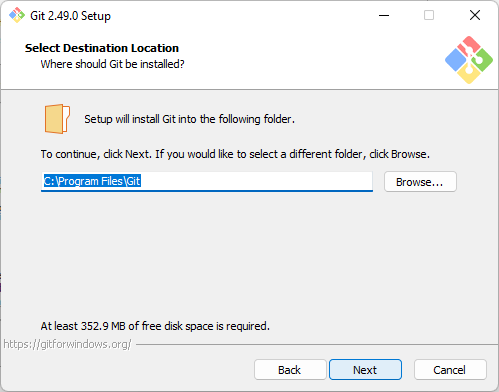
   3. 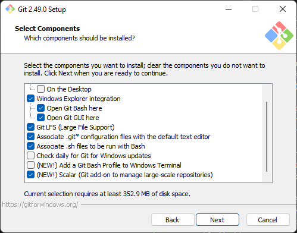
   4. 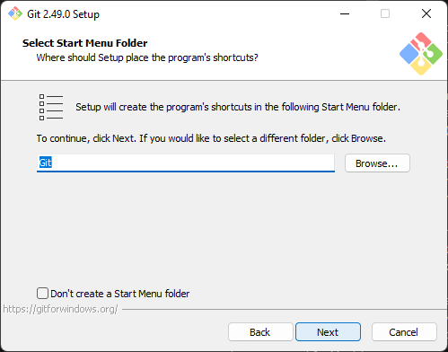
   5. 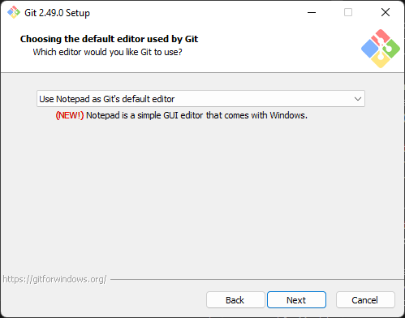
   6. 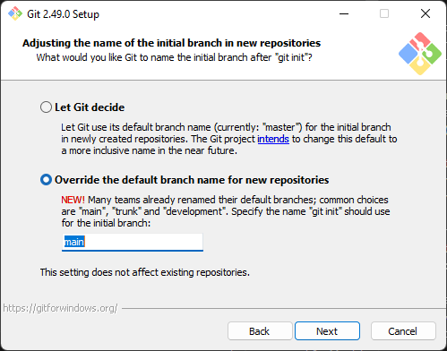
   7. 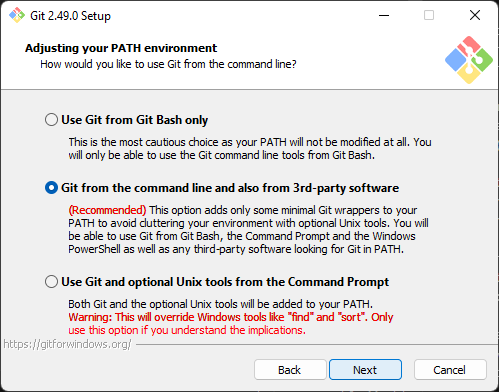
   8. 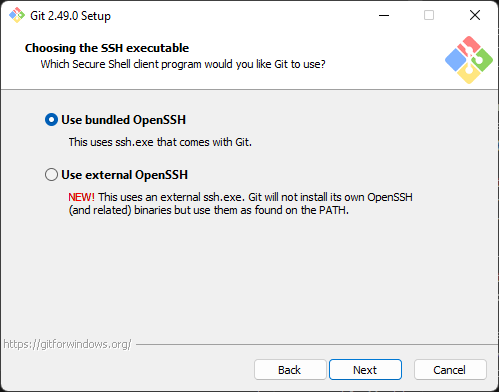
   9. 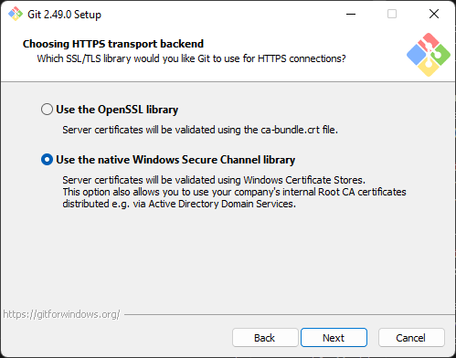
   10. 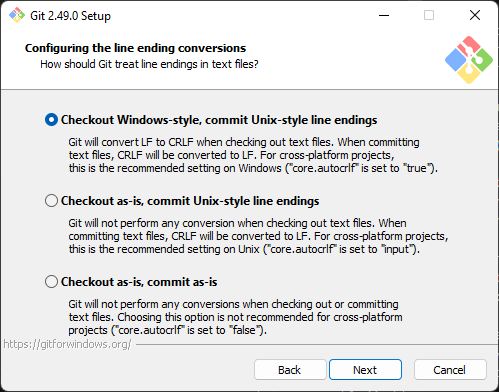
   11. 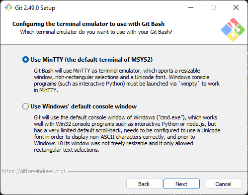
   12. 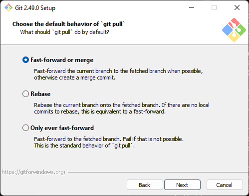
   13. 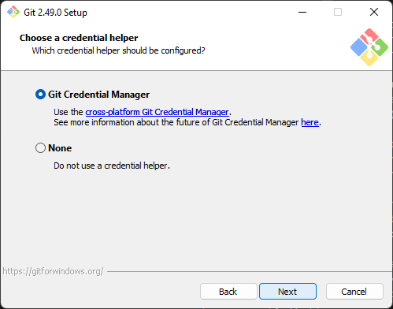
   14. 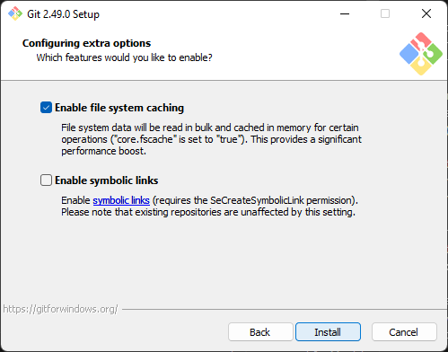
   15. 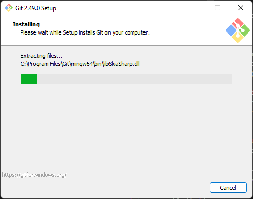
   16. 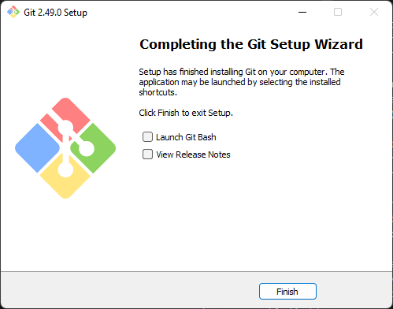
3. Open **Git Bash** from the Start Menu to start using Git.


---

## ⚙️ Initial Git Configuration

After installation, run these commands:

```bash
git config --global user.name "Your Name"
git config --global user.email "your.email@example.com"
```

Check your configuration with:

```bash
git config --list
```

---

## 🧑‍💻 Basic Git & GitHub Workflow

### 1. Create a Repository on GitHub

1. Go to [https://github.com](https://github.com)
2. Click **New repository**
3. Enter a name and (optional) description, then click **Create repository**

### 2. Clone the Repository Locally

```bash
git clone https://github.com/username/repo-name.git
cd repo-name
```

### 3. Add and Manage Files

```bash
# Check status
git status

# Add a new file
git add filename.txt

# Commit the changes
git commit -m "Description of the changes"

# Push to GitHub
git push origin main
```

### 4. Pull Updates from GitHub

```bash
git pull origin main
```

---

## 🔄 Basic Git Workflow

```bash
git clone <repository-url>
# Make changes to files
git add .
git commit -m "Your commit message"
git push origin main
```

---

## 💡 Tips

* Use a `.gitignore` file to exclude files or directories from version control
* Use `git log` to view commit history
* Try [GitHub Desktop](https://desktop.github.com) for a graphical interface

---

## 📚 Additional Resources

* [Git Documentation](https://git-scm.com/doc)
* [GitHub Docs](https://docs.github.com)

